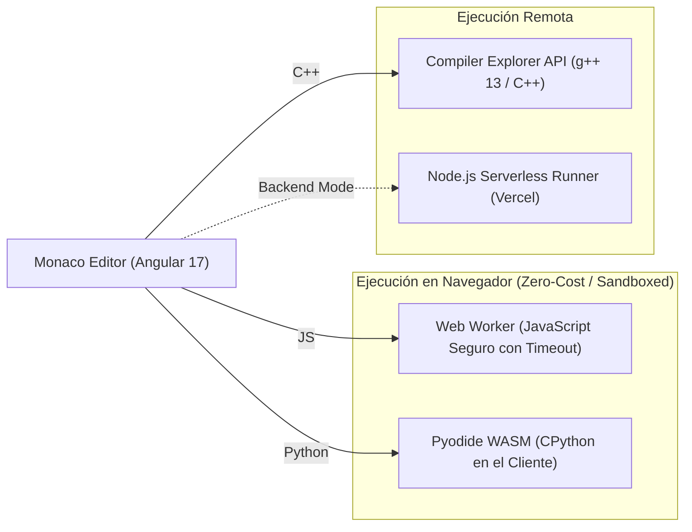

# CodeRunner - Cloud & WebAssembly Online Code Compiler

[](https://angular.dev/)
[](https://www.typescriptlang.org/)
[-654FF0?style=flat-square&logo=webassembly)](https://pyodide.org/)

**CodeRunner** es un entorno de ejecución de código en la nube y en el cliente que permite a los desarrolladores escribir, compilar y probar algoritmos en **Python, JavaScript y C++** directamente desde el navegador, con cero latencia de servidor en entornos WASM.

> 🚀 **Demo en Vivo:** [code-runner-navy.vercel.app](https://code-runner-navy.vercel.app) *(o [GitHub Pages](https://rizzot0.github.io/codeRunner/))*

---

## ⚡ Enfoque de Arquitectura: Ejecución Híbrida Segura

A diferencia de los editores convencionales que requieren costosos clusters de servidores para ejecutar código arbitrario, CodeRunner emplea una estrategia de ejecución híbrida:



### Características Técnicas Clave
* **Monaco Editor Integrado:** La misma experiencia de edición de Visual Studio Code (autocompletado, temas dark/light, validación sintáctica).
* **Python vía WebAssembly (Pyodide):** Intérprete CPython completo ejecutado directamente en el hilo del navegador sin exponer infraestructura de backend a inyección de comandos maliciosos.
* **JavaScript Sandboxing:** Ejecución aislada en un `Web Worker` con mecanismos de timeout para prevenir bloqueos por bucles infinitos.
* **Integración C++ con Compiler Explorer:** Soporte de compilación en tiempo real con g++ moderno vía endpoints seguros con CORS configurado.

---

## 💻 Tecnologías Utilizadas

* **Frontend:** Angular 17, TypeScript, Monaco Editor API, PrimeNG UI Components.
* **Runtimes del Cliente:** WebAssembly, Pyodide v0.26+, Web Workers API.
* **Backend Opcional (Serverless):** Node.js 18+, Vercel Serverless Functions.

---

## 🛠️ Ejecución Local

```bash
# Clonar el proyecto
git clone https://github.com/rizzot0/codeRunner.git
cd codeRunner

# Instalar dependencias del cliente
cd Frontend
npm install

# Iniciar servidor de desarrollo Angular
npm run start
```
Abre tu navegador en `http://localhost:4200`.
